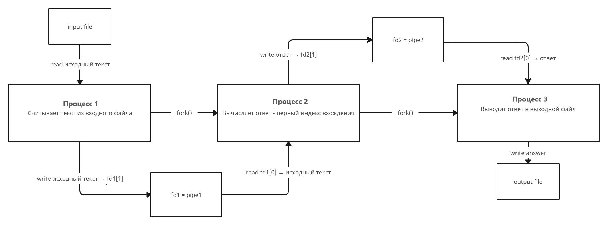
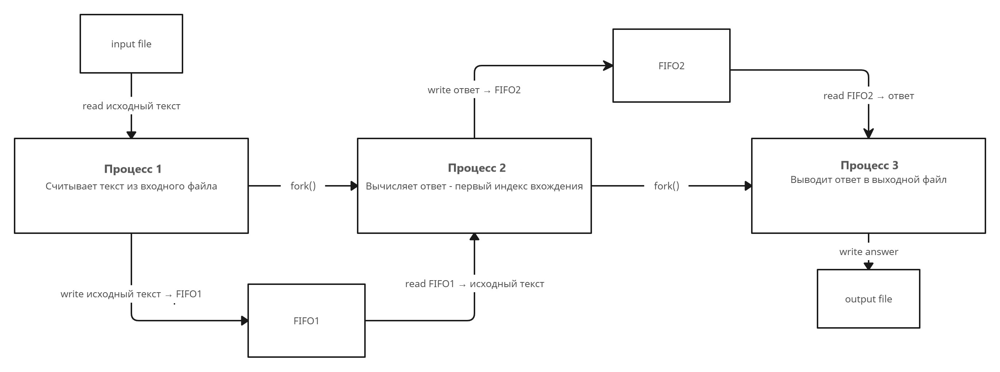
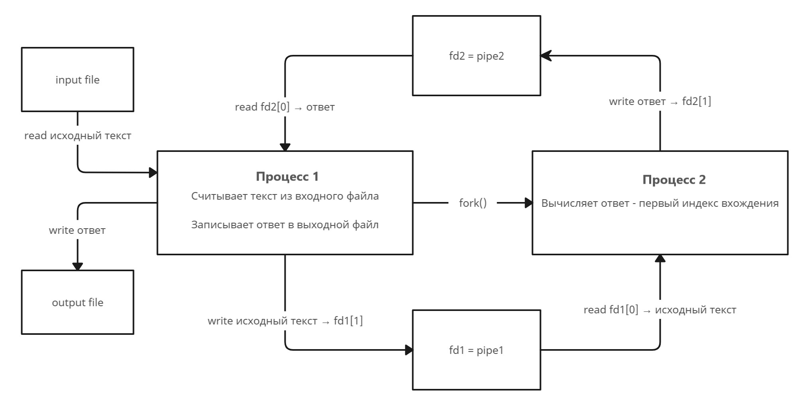
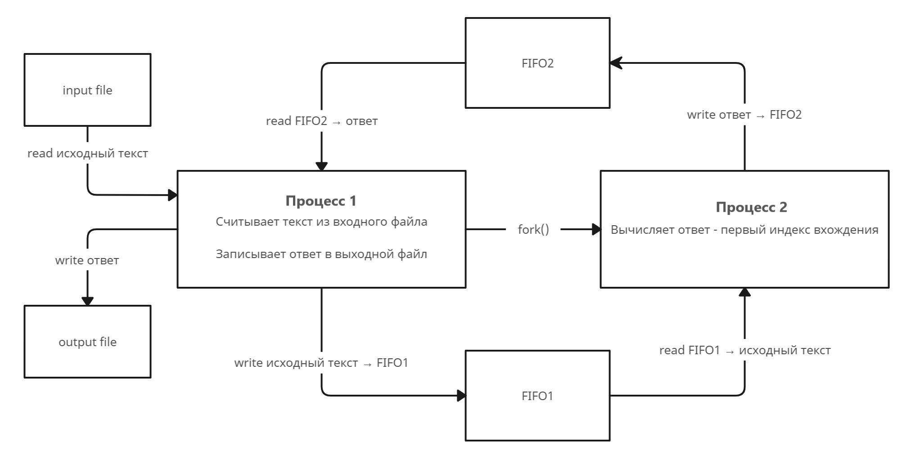
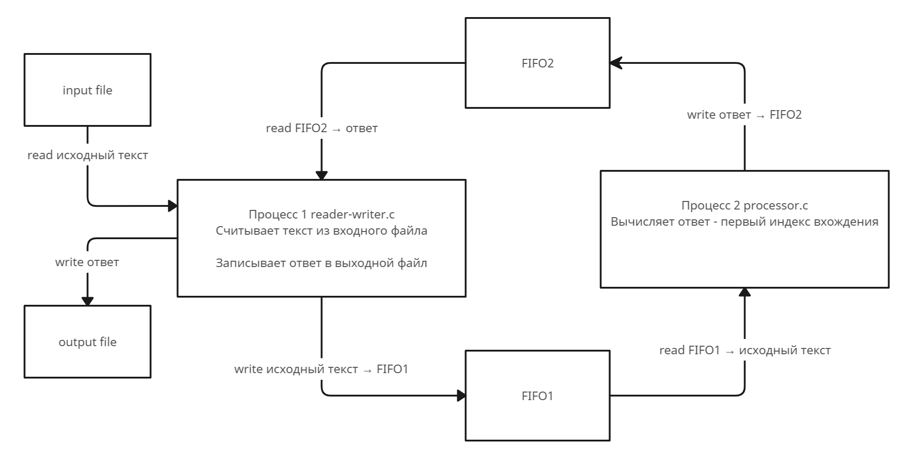

# Индивидуальное домашнее задание №1, Вариант 23
## **Исполнитель**: Копырина Полина Ивановна, группа БПИ213

## **Условие задачи**:  
### Разработать программу, которая ищет в ASCII-строке заданную подстроку и возвращает индекс первого символа первого вхождения подстроки в строке. Подстрока вводится как параметр.


## **Реализованные программы**:

### Общие детали:

Размер буфера во всех программах - 5001 байт (5000 символов, не считая '\0').

#### **Запуск и формат ввода**
Скомпилировать программу можно командой
```
gcc main.c -o program
```

Запустить программу можно командой
```
./program input.txt output.txt substring
```

где 
* input.txt - имя файла с входными данными
* output.txt - имя файла с выходными данными
* substring.txt - искомая подстрока

_Это работает для всех программ, кроме последней (на 8 баллов) Для программы на 8 баллов процесс запуска будет описан отдельно._

#### **Формат вывода**
Файл с выходными данными после работы программы должен содержать одно число - индекс первого символа первого вхождения искомой подстроки в данную строку. Индексы нумеруются с 0. Если строка не содержит искомую подстроку, то файл должен содержать число -1.

#### **Тесты**

Для всех программ используются общие тестовые входные данные. Они лежат в каталоге tests. Каждый тест состоит из двух файлов:
* _test{number}.txt_ - входной текст для теста с номером _number_.
* _substring{number}.txt_ - искомая подстрока (параметр, который задается как
последний аргумент командной строки)

Результаты тестов (выходные данные) для каждой программы хранятся в директории _for{number}/test_results_ для каждой программы; _number_ соответствует баллам за программу.


## **На 4 балла**
Разработка программы, осуществляющей взаимодействие между тремя дочерними процессами с использованием неименованных каналов.

**Схема решения:**


Во время исполнения программы образуются 3 родственных процесса, на схеме с помощью стрелки "fork" показано, от какого процесса "отделяется" процесс при создании.

Взаимодействие процессов устроено с помощью конвейерной передачи данных через неименнованные каналы pipe. Первый канал pipe(fd1) - взаимодействие 1 и 2 процессов, pipe(fd2) - взаимодействие 2 и 3 процессов.

## **На 5 баллов**
Программа, в которой взаимодействие между
тремя дочерними процессами осуществляется через именованные каналы.

**Схема решения:**


Во время исполнения программы образуются 3 родственных процесса, на схеме с помощью стрелки "fork" показано, от какого процесса "отделяется" процесс при создании.

Взаимодействие процессов устроено с помощью конвейерной передачи данных через именованные каналы.
Процесс 1 и 2 обмениваются информацией с помощью канала FIFO1,
процес 2 и 3 - с помощью канала FIFO2.
Перед обращением к каналу каждый процесс сначала пытается создать именнованный канал с помощью команды
```
mknod("FIFO", S_IFIFO | 0666, 0);
```

## **На 6 баллов**
Программу, которая осуществляет взаимодействие между
двумя дочерними процессами с использованием неименованных каналов

**Схема решения:**


Во время исполнения программы образуются 2 родственных процесса, на схеме с помощью стрелки "fork" показано, от какого процесса "отделяется" процесс при создании.

Взаимодействие процессов устроено с помощью двунаправленной передачи данных через неименнованные каналы pipe.

Процесс 1 считывает исходные данные из input file, передает текст на обработку второму процессу через pipe  (fd1), процесс 2 обрабатывает данные и передает ответ через pipe (fd2) процессу 1, процесс 1 выводит ответ в output file.


## **На 7 баллов**
В дополнение к требованиям на предыдущую оценку разработать программу, которая осуществляет взаимодействие между
двумя дочерними процессами с использованием именованных
каналов

**Схема решения:**


Во время исполнения программы образуются 2 родственных процесса, на схеме с помощью стрелки "fork" показано, от какого процесса "отделяется" процесс при создании.

Взаимодействие процессов устроено с помощью двунаправленной передачи данных через именованные каналы.

Процесс 1 считывает исходные данные из input file, передает текст на обработку второму процессу через FIFO1, процесс 2 обрабатывает данные и передает ответ через FIFO2 процессу 1, процесс 1 выводит ответ в output file.

Перед обращением к каналу каждый процесс сначала пытается создать именнованный канал с помощью команды
```
mknod("FIFO", S_IFIFO | 0666, 0);
```

## **На 8 баллов**
Программа, которая осуществляет взаимодействие между
двумя независимыми (неродственными) процессами с использованием именованных каналов

**Схема решения:**


Каждый из двух процессов создается отдельной программой.
1 процесс - 'reader-writer.c'; 2 процесс - 'processor'.
Чтобы скомпилировать программы, нужно ввести команды:

Скомпилировать программу можно командой
```
gcc reader-writer.c -o io
gcc processor.c -o processor
```

Чтобы запустить программу, нужно из двух разных терминалов (или другим удобным способом, но вам нужно запустить параллельно две программы):

Запуск первого процесса (который считывает и выводит данные из файлов).
* input.txt - файл с входными данными
* output.txt -  файл с выходными данными
```
./io input.txt output.txt
```

Запуск второго процесса (который обрабатывает данные и вычисляет ответ).
* substring - искомая подстрока
```
./processor substring
```

Во время выполнения программы создаются два неротсвенных процесса.
Процесс 1 (reader-writer) считывает исходные данные из input file, передает текст на обработку второму процессу (processor) через FIFO1, процесс 2 обрабатывает данные и передает ответ через FIFO2 процессу 1, процесс 1 выводит ответ в output file.
